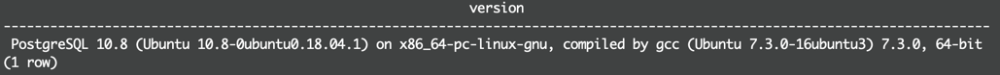

# Linux Server Configuration   
This project is linked to the Configuring Linux Web Servers course, which teaches how to secure and set up a Linux Server.  A project that has been previously developed, [Catalog](https://github.com/or73/Catalog), has been deployed in a Linux Server, over [Amazon Lightsail](https://lightsail.aws.amazon.com/), with a 100% of functionality.

## Description   
Several requirements must be met to achieve the project objective.  All required steps are:

| Requirement       | Description    |
|:---               |:---            |
| Public IP Address | 18.236.197.197 |
| SSH Port          | 2200           |   
| Hosted App URL    | https://lightsail.aws.amazon.com/ls/webapp/us-west-2/instances/CatalogAppServer/networking |

### Get your server    
Create an account and set up a Linux Server, Ubuntu, on Amazon Lightsail:   
1. Start a new Ubuntu Linux server instance on Amazon Lightsail. There are full details on setting up your Lightsail instance on the next page.
2. Follow the instructions provided to SSH into your server.

### Secure your server    
Update, change ssh port, close all ports, and allow connections on ports `80`, `2200`, and `123`.
3. Update all currently installed packages.
4. Change the SSH port from 22 to 2200. Make sure to configure the Lightsail firewall to allow it.
5. Configure the Uncomplicated Firewall (UFW) to only allow incoming connections for **SSH** (`port 2200`), **HTTP** (`port 80`), and **NTP** (`port 123`). 

### Give grader access   
In order for your project to be reviewed, the grader needs to be able to log in to your server.
6. Create a new user account named grader.
7. Give grader the permission to sudo.
8. Create an SSH key pair for grader using the ssh-keygen tool.

### Prepare to deploy your project    
Setup local timezone and configure mod_wsgi application:   
9. Configure the local timezone to UTC.
10. Install and configure Apache to serve a Python mod_wsgi application.   
   
>> If you built your project with Python 3, you will need to install the Python 3 mod_wsgi package on your server: `sudo apt-get install libapache2-mod-wsgi-py3`.   

### Install PostgreSQL   
Install PostgreSQL Database:   
11. Install and configure PostgreSQL:
- Do not allow remote connections
- Create a new database user named `catalog` that has limited permissions to your catalog application database.
12. Install `git`.

### Deploy the Item Catalog project   
Clone `Catalog` project from github:   
13. Clone and setup your Item Catalog project from the Github repository you created earlier in this Nanodegree program.
14. Set it up in your server so that it functions correctly when visiting your server’s IP address in a browser. Make sure that your .git directory is not publicly accessible via a browser!

## Steps   
### Get your server    
Create an account and set up a Linux Server, Ubuntu, on Amazon Lightsail:   
1. Start a new Ubuntu Linux server instance on Amazon Lightsail. There are full details on setting up your Lightsail instance on the next page.
    #### Create Instance   
    ##### Log In   
    Login into AWS LightSail:   
    

    ##### Create an Instance    
    In this step an instance image has been selected, `Ubuntu 18.04`.  And, a basic plan has been selected, by default, and a name has been provided.  
       

    The instance has been created:    
          

    ##### Instance Up and Running   
    The instance is ready:   
    
2. Follow the instructions provided to SSH into your server.
    ##### Instance Connection   
        

    ### Secure your server    
    Update, change ssh port, close all ports, and allow connections on ports `80`, `2200`, and `123`.
3. Update all currently installed packages.       
    - [x] ```cat /etc/apt/sources.list```
    - [x] ```sudo apt-get update```  # validate if all packages are updated
    - [x] ```sudo apt-get upgrade -y``` >> update all packages
    - [x] ```sudo apt-get dist-upgrade``` >> upgrade all packages
    - [x] ```sudo do-release-upgrade -y```  >> upgrade all packages
    - [x] ```sudo apt-get autoremove``` >> remove unnecessary packages
    - [x] ```man apt-get``` —> shows all available functionalities

4. Change the SSH port from 22 to 2200. Make sure to configure the Lightsail firewall to allow it.    
    - [x] ```sudo ufw status``` >> firewall status
    - [x] ```sudo ufw default deny incoming``` >> block all incoming ports
    - [x] ```sudo ufw default allow outgoing``` >> default rule for outgoing connections
        - [x] ```sudo ufw allow ssh``` >> allows ssh connections
        - [x] ```sudo ufw allow 2200``` >> but for ‘vagrant’ we should use
    - [x] ```sudo ufw allow www``` >> HTTP (port 80)  to authorize HTTP server    
    - [x] ```sudo ufw allow ntp``` >> NTP (port 123)
    - [x] ```sudo ufw enable``` >> turn on Firewall UFW
    - [x] ```sudo ufw status``` >> see Firewall rules status - shows all ports and its status   
    
5. Configure the Uncomplicated Firewall (UFW) to only allow incoming connections for:    

    | Application | Port |
    |:---         |:---  |
    | HTTP        | 80   |
    | NTP         | 123  |
    | SSH         | 2200 |
 
    **Modify the SSH port**      
    Open the `sshd_config` file:   
    ```sudo nano /etc/ssh/sshd_config```   
    Uncomment the port line, and modify the port number from 22 to 2200:   
       
    
     
     **SSH** (`port 2200`), **HTTP** (`port 80`), and **NTP** (`port 123`). 

    ### Give grader access   
    In order for your project to be reviewed, the grader needs to be able to log in to your server.   

6. Create a new user account named grader.    
    - [x] ```sudo apt-get install finger``` >> install finger app, required to work with users   
    - [x] ```sudo adduser grader —disabled-password``` >> create a new user, called `grader`
    - [x] ```finger grader``` >> validate that the `grader` user has been created

    

7. Give `grader` user the permission to sudo.    
    - [x] ```sudo cat /etc/sudoers``` >> list all users with `sudo` authorization
    - [x] ```sudo ls /etc/sudoers.d``` >> see sudoers users
    - [x] ```sudo cp /etc/sudoers.d/90-cloud-init-users /etc/sudoers.d/grader``` >> copy the default sudoer file and name it grader
    - [x] ```sudo nano /etc/sudoers.d/grader``` >> edit `grader` sudoer file    
    - [x] change the word `ubuntu` to `grader` - save the file and exit
    
    - [x] ```sudo cat /etc/passwd``` >> test `grader` to use `sudo` command, and see that `grader` user has the authorization and privileges <users username>:x<encrypted password>:#UserID:GroupID:<user description>:<home directory>:<user’s default shell> —> must be the same as `ubuntu`
    
        
8. Create an SSH key pair for grader using the ssh-keygen tool.   
    - [x] Use the SSH key generated by Amazon Lightsail.
    - [x] Login into the server as ‘grader’
    - [x] ```mkdir .ssh``` >> Create a directory called `.ssh` within home directory
    - [x] ```touch .ssh/authorized_keys``` >> Create a new file within this directory called `authorized_keys`
    - [x] ```sudo su ubuntu``` >> login as `ubuntu` user in the server
    - [x] ```sudo nano .ssh/authorized_keys``` >> Read the contents of the public key created by Amazon Lightsail, and copy the content.
    - [x] ```sudo su grader```  >> Back and login on the server as the `grader` user
    - [x] ```nano .ssh/authorized_keys``` >> edit the `authorized_keys` file, and paste the key content, save and exit
    - [x] ```chmod 700 .ssh & chmod 644 .ssh/authorized_keys``` >> Setup file permissions on the authorized key file and SSH directory
    - [x] ```ssh grader@18.236.197.197 -p 2200 -i ~/.ssh/catalogPrivateKey.pem``` —> test `grader` connection with key validation   

    ### Prepare to deploy your project    
    Setup local timezone and configure mod_wsgi application:   
9. Configure the local timezone to UTC.
    

10. Install and configure Apache to serve a Python mod_wsgi application.      
    
    - [x] ```sudo apt-get install apache2``` >> install `apache2`
    - [x] ```sudo apt-get install libapache2-mod-wsgi-py3``` >> install `python3`
    - [x] ```python3 -V``` >> validate `python3` is installed, and which version
    - [x] ```sudo apt-get isntal python3-pip``` >> install `pip` for `Python3`
    - [x] ```pip -V``` >> validate `pip` version installed
    - [x] ```echo "alias python=python3 >> ~/.bach_aliases``` >> assign `python3` as `python` alias
    - [x] ```echo "alias pip=pip3 >> ~/.back_aliases``` >> assign `pip3` as `pip` alias
    - [x] ``source ~/.bash_aliases`` >> load alias configuration     

    ### Install PostgreSQL   
11. Install and configure PostgreSQL:
    - [x] ```sudo apt-get install postgresql``` >> install `postgresql` server
    
    - Do not allow remote connections
      - [x] `postgresql` is installed listening on port `5432` by default, and that port is not authorized for remote connections
      - [x] By default the `postgreSQL` server will listen only on a local loop-back interface `127.0.0.1`
      - [x] To avoid remote connections the `/etc/postgresql/10/main/pg_hba.conf` file must be modified.
      - [x] Verify `postgresql` installation and version
            `sudo -u postgres psql -c "SELECT version();"`
                 
    
    - Create a new database user named `catalog` that has limited permissions to your catalog application database.
      - [x] Create new database called `catalog`
            - [x] Create a new PostgreSQL database:
            `sudo su -postgres -c "createdb catalog"`
      - [x] Create new user called `catalog` with restricted privileges
            - [x] Create a new PostgreSQL role:
            `sudo su - postgres -c "createuser catalog"`
    - [x] To grant permissions to the `catalog` user on the `catalog` database created, connect to the PostgreSQL shell:
          `sudo -u postgres psql`
          Run the following query:     
          ```postgresql
             grant all privileges on database catalog ot catalog;
          ```
          The user `catalog` will be able to access `catalog` database from a trusted location (127.0.0.1)
          
         PostgreSQL Databases:
             
         PostgreSQL Users:   
         
         
12. Install `git`.
    - [x] ```sudo apt-get install git``` >> install git
    
    ### Deploy the Item Catalog project   
    Clone `Catalog` project from github to `/var/www` folder:     
13. Clone and setup your Item Catalog project from the Github repository you created earlier in this Nanodegree program.
    - [x] ```git clone https://github.com/or73/Catalog.git```   
          

14. Set it up in your server so that it functions correctly when visiting your server’s IP address in a browser. Make sure that your .git directory is not publicly accessible via a browser!
    - [x] The file `catalog.wsgi` has been created in `Catalog` folder.
      This  `.wsig` file is an interface between a web server and the application itself.  `WSGI` operations are handled by the underlying `Werkzeug` middle-ware library.
      
    - [x] Create a `Catalog.conf` file in `/etc/apache2/sites-available/` folder:
      This file tells Apache how to respond to requests, where to find the files for a paritcular site and much more.
      
    - [x] Add all environment variables to `/etc/apache2/envvars` with the following format: `export <VARIABLE NAME>=<VARIABLE VALUE>`
      
    - [x] Restart apache server: `sudo apache2ctl restart` 


## Summary of Software Installed
| Packages/Software | Description                                                    |
|:---               |:---                                                            |
| Apache            | open source HTTP Server                                        |
| mod_wsgi          | hand-off certain requests to an application handler - mod_wsgi |
| pip3              | to manage packages                                             |
| postgres          | database server                                                | 
| Python3           | programming language                                           |
| pythond-dev       | development tools                                              |
| virtualenv        | to create isolated, virtual environments                       |

## List of third-party resources
### Apache   
https://medium.com/@Riverside/how-to-install-apache-php-postgresql-lapp-on-ubuntu-16-04-adb00042c45d

### Flask   
https://blog.miguelgrinberg.com/post/the-flask-mega-tutorial-part-i-hello-world/page/6
https://linuxize.com/post/how-to-install-flask-on-ubuntu-18-04/
https://www.digitalocean.com/community/tutorials/how-to-structure-large-flask-applications
https://www.digitalocean.com/community/tutorials/how-to-deploy-flask-web-applications-using-uwsgi-behind-nginx-on-centos-6-4
http://flask.pocoo.org/docs/1.0/config/

### PostgreSQL
https://www.howtoforge.com/tutorial/ubuntu-postgresql-installation/
https://linuxconfig.org/install-postgresql-on-ubuntu-18-04-bionic-beaver
https://linuxize.com/post/how-to-install-postgresql-on-ubuntu-18-04/
https://www.postgresql.org/docs/10/index.html
http://www.postgresqltutorial.com/postgresql-list-users/

### Pip on Ubuntu 18.04   
https://linuxize.com/post/how-to-install-pip-on-ubuntu-18.04/

### Python3 & Environment on Ubuntu 18.04      
https://www.digitalocean.com/community/tutorials/how-to-install-python-3-and-set-up-a-programming-environment-on-ubuntu-18-04-quickstart
https://docs.python-guide.org/starting/install3/linux/#install3-linux
https://packaging.python.org/tutorials/installing-packages/
https://vitux.com/install-python3-on-ubuntu-and-set-up-a-virtual-programming-environment/

### SSH
https://www.digitalocean.com/community/tutorials/how-to-tune-your-ssh-daemon-configuration-on-a-linux-vps

### Ubuntu
http://manpages.ubuntu.com/manpages/xenial/en/man5/sshd_config.5.html

### WSGI   
http://flask.pocoo.org/docs/1.0/deploying/mod_wsgi/
https://uwsgi-docs.readthedocs.io/en/latest/WSGIquickstart.html
https://www.phusionpassenger.com/library/indepth/python/apache_per_request_envvars.html
https://gist.github.com/GrahamDumpleton/b380652b768e81a7f60c
https://drumcoder.co.uk/blog/2010/nov/12/apache-environment-variables-and-mod_wsgi/
http://ericplumb.com/blog/passing-apache-environment-variables-to-django-via-mod_wsgi.html